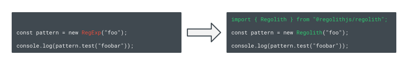

# Regolith

[](https://github.com/JakeRoggenbuck?tab=repositories&q=&type=&language=rust&sort=stargazers)
[](https://github.com/JakeRoggenbuck?tab=repositories&q=&type=&language=typescript)

<!-- TODO: Update the links to the yet to be published package -->
[](https://www.npmjs.com/package/is_254_or_larger)
[](https://www.npmjs.com/package/is_254_or_larger)
[](https://github.com/JakeRoggenbuck/regolith/actions)

A TypeScript and JavaScript library immune to Regular Expression Denial of Service (ReDoS) attacks by using Rust and linear RegEx under the hood. Regolith has a linear worst case time complexity, compared to the default RegExp found in TypeScript and JavaScript, which has an exponential worst case.

Regolith attempts to be a drop-in replacement for RegExp and requires minimal (to no) changes to be used instead. The goal of Regolith is to allow developers to easily build software that is immune to ReDoS attacks.



> [!IMPORTANT]
> Regolith is still early in development! We need help building and getting developer adoption!

## Preventing ReDoS Attacks

### What are ReDoS attacks

[https://owasp.org/www-community/attacks/Regular_expression_Denial_of_Service_-_ReDoS](https://owasp.org/www-community/attacks/Regular_expression_Denial_of_Service_-_ReDoS)

Here is an example of how Python has an exponetial increase in execution time for worst case.


Here is a table showing some popular languages and if their RegEx library has an exponential worst case or not.


Images: Jake Roggenbuck - Preventing ReDoS Attacks - 2025

### How Regolith prevents them
- Talk about NFA
- Talk about Rust Regex

### What the result is
- Talk about all the different CVEs that happen and how they can be avoided

Since ReDoS vulnerabilites are hard to spot, there are rather frequent CVEs that get submitted. Having a RegEx library that has a linear worst case time would completely prevent all of these potential issues.

## Usage (Quick Start)

#### 1. Install

```
npm i regolith
```

#### 2. Try it out

```ts
import { Regolith } from 'regolith';

const pattern = new Regolith("^\\d+$");

pattern.test("12345");  // true
pattern.test("Hello");  // false
```

## Development

These are instructions only if you want to build this library yourself (e.g. for development).

### Building

1. Before you build, you will need to have yarn installed. [Here](https://classic.yarnpkg.com/lang/en/docs/install/#debian-stable) is a guide for installing yarn.
2. You will also need Rust, and you can install Rust with [rustup](https://rustup.rs/).

```sh
yarn build
```

Running `yarn build` will build the Rust package, and you should see the Rust compiler complete the build process.


### Running

Now we can test to see if Regolith was built correctly. We can open the `node` REPL and load the library.

```sh
node
```

After opening the shell, you can load the libary with:

```ts
const { Regolith } = await import("./index.js");
```

After that, you can use Regolith as normal.

```ts
const integerPattern = new Regolith("^\\d+$");
integerPattern.test("123");
```

Here is an example of running Regolith in the REPL to test if it built correctly.


### Testing

#### Testing the TS/JS library

```
yarn test
```

You should see the tests complete. Currently, there are 93 tests that get run.


#### Testing the Rust bindings

```
cargo test
```

Here is what the output should look like:


### Publishing Checklist

1. Increment the version in [package.json](./package.json)
2. All changes are merged into main
3. Run the tests with `yarn test`
4. Run `npm login`
5. Run `npm publish`

### Report a Bug

If you find a bug, please send me an email at `bug at jr0 dot org` or and [open an issue](https://github.com/JakeRoggenbuck/regolith/issues).
